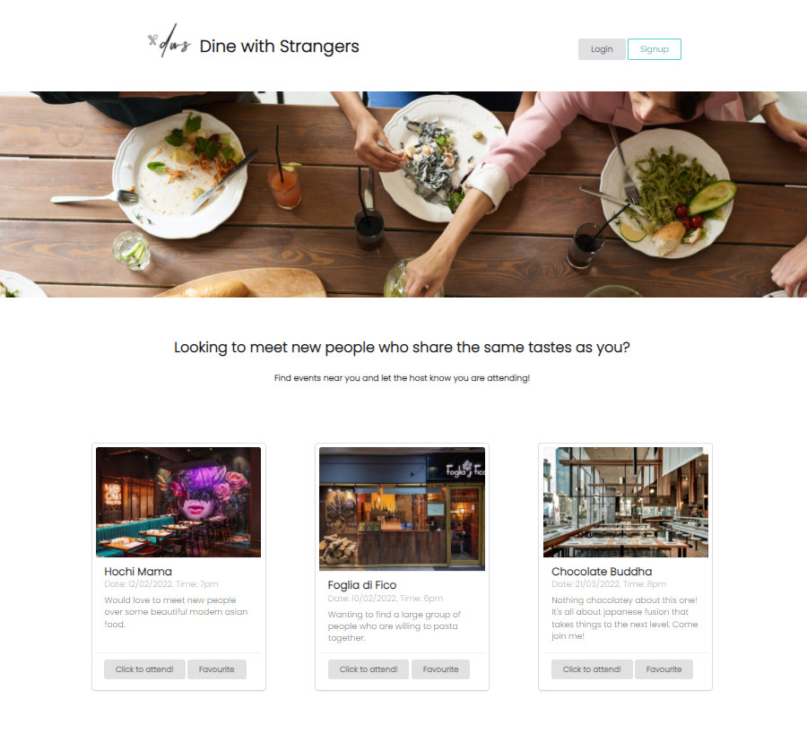
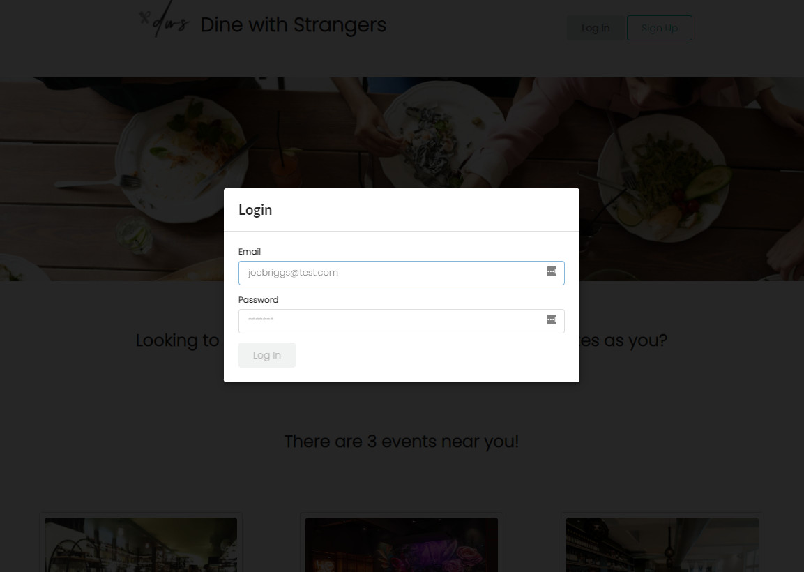
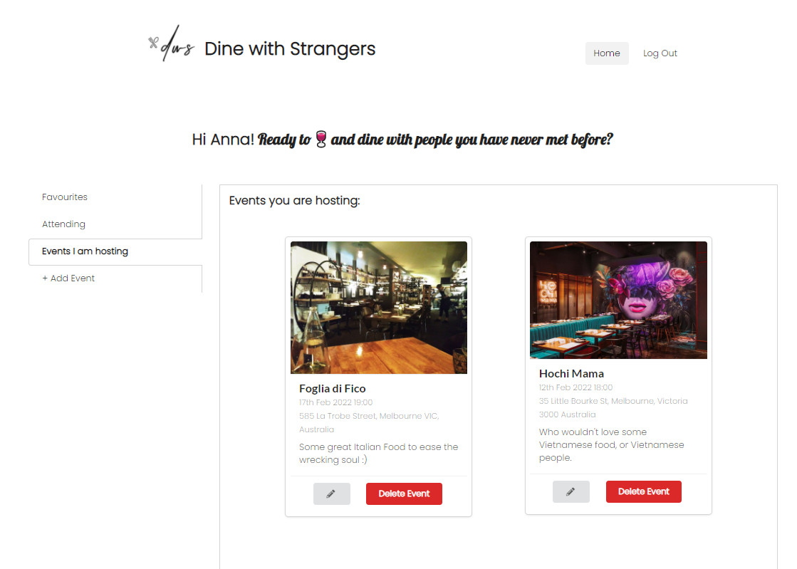

# Dine with Strangers

## Table of Contents

- [Description](#description)
- [Installation Instructions](#installation-instructions)
- [Usage Information](#usage-information)
- [Link to Application](#link-to-application)
- [Questions](#questions)

## Description

Do you find it hard to meet new people that share the same interests? Specifically food interests? Seek no more!
This application allows users to find events they would like to attend based on the restaurant/cuisine posted. Users can attend, favourite or add/edit/delete their hosted event.

## Installation Instructions

Git clone https://github.com/AnnaNguyen1/Dine-With-Strangers.git

To install necessary dependencies, run the following command(s):

```bash
npm i
```

Run `npm run develop` in the terminal to run the app in development mode and view on local host.

## Usage Information

- Users can login if they have an account, or signup to a new account to start rsvp-ing to events.







## Link To Application

Deployed Application: https://dinewithstrangers.herokuapp.com/

## Questions

If you have any questions about the repo, please open an issue or contact me directly at n.annabich@gmail.com. You can find more of my work <a href="https://github.com/AnnaNguyen1" target="_blank">here</a>.
